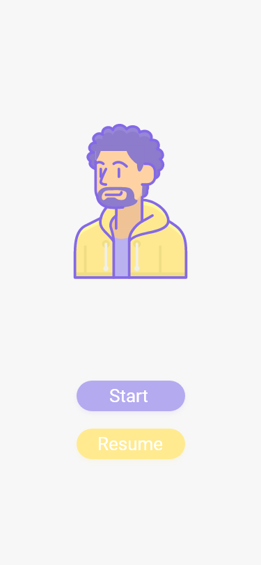
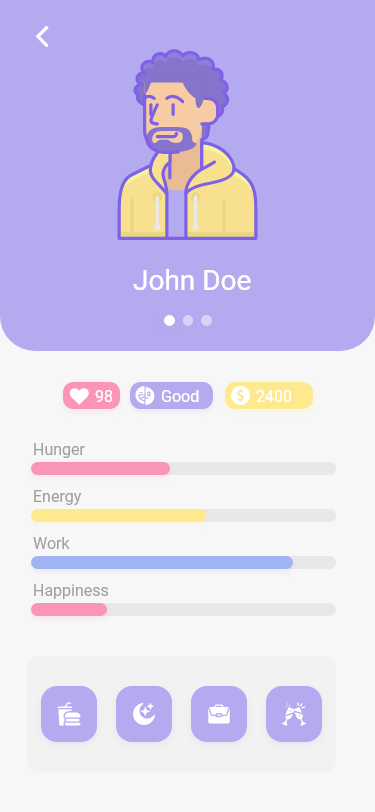

# PocketFriend
PocketFriend is a virtual friend app that requires a user to keep their virtual friend healthy and happy.

**About:**

Keep your virtual friend alive! Pocket friend allows user to interact and keep a virtual friend. 
If the user neglects their friend their friend is free to leave and probalby wil leave.

**Features:**

PocketFriend allows users to look after a virtual friend. Users will be able to make their virtual friend:
- Eat
- Sleep
- Work
- Party

Each of these actions will affect your virtual friend in a positive or negative way. Also remeber to always 
keep an eye on your friend you never know what mood they are in.

**Wireframes:**

 

**How to use:**

1) Open Visual Studio community on your computer.
2) Locate the sln file for PocketFreind.
3) Open the sln file in Visual Studio
4) Select your virtual device and run the program.
5) One the program has been built you will be greeted with a welcome scrren.
6) Now it is time to make a virtual friend!

**Technologies used:**

- Xamarin and Xamarin.Forms
- C#
- Visual Studio Code

